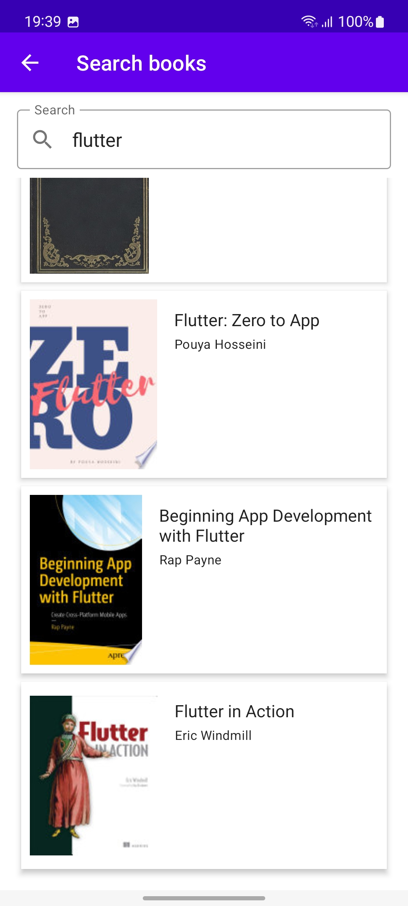

# Favorite Book

Favorite Book is an Android application in which you can search for books thanks to the Google books
API. You can see all the details about the book that you are interested in. Save your favorite books
into local storage.

## Getting Started

1. Clone the project to your local machine.
2. Open the project using Android Studio.

### Installation

Step by step explanation of how to get a dev environment running.

```
1. To enable Firebase Authentication:
    a. Go to the authentication tab at the Firebase console and enable Email/Password Sign-in method.
    b. download `google-services.json` and add it to the app.
2. Run the app on your mobile phone or emulator.
```

### Screenshots





## Built With

- [Retrofit](https://square.github.io/retrofit/) - A type-safe HTTP networking library to make API
  requests
- [Room](https://developer.android.com/jetpack/androidx/releases/room) - The persistence library
- [Firebase](https://firebase.google.com/firebase) - For signing users
- [Coil](https://coil-kt.github.io/coil/compose/) - An image loading library
- [Hilt](https://developer.android.com/training/dependency-injection/hilt-android) - Dependency
  injection library

## Continuous development

The app will implement FirebaseFirestore to store books and all of its details. It will be possible
to leave review and rating to each book. The app will be tested.